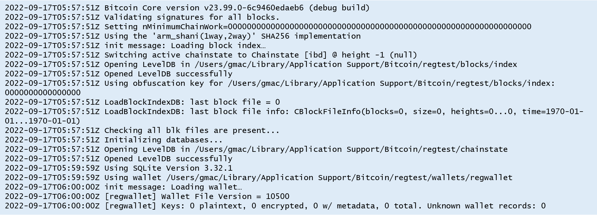

# Exercises for Bitcoin Protocol Development

1. Compile Bitcoin Core (https://github.com/bitcoin/bitcoin). You can see doc/build-*.md for instructions on building the various elements.  

- compile and run bitcoin-core regtest  
  

2. Run the unit and functional tests. Instructions on how to do that can be found here: (https://github.com/bitcoin/bitcoin/blob/master/test/README.md).

3. test code snippets  
gist link : https://gist.github.com/guhwan/e8619a1442de24ab3d5bc5ec101fff10
```
# 1. try getting node 1 to mine another block
for _ in range(10):
    # Use the blocktools functionality to manually build a block.
    # Calling the generate() rpc is easier, but this allows us to exactly
    # control the blocks and transactions.
    block = create_block(self.tip, create_coinbase(height+1), self.block_time)
    block.solve()
    block_message = msg_block(block)
    # Send message is used to send a P2P message to the node over our P2PInterface
    # print('block_message',block_message)
    peer_messaging.send_message(block_message)
    self.tip = block.sha256
    blocks.append(self.tip)
    self.block_time += 1
    height += 1

...

# 2. send it to node 2

self.log.info("Wait for node2 to receive all the blocks from node1")
self.sync_all()

...

# 3. check that node 2 received it.

self.log.info("Check that the blocks's tips of node 1 and node 2 are the same.")
print(int(self.nodes[1].getbestblockhash(), 16))
print(int(self.nodes[2].getbestblockhash(), 16))
```

